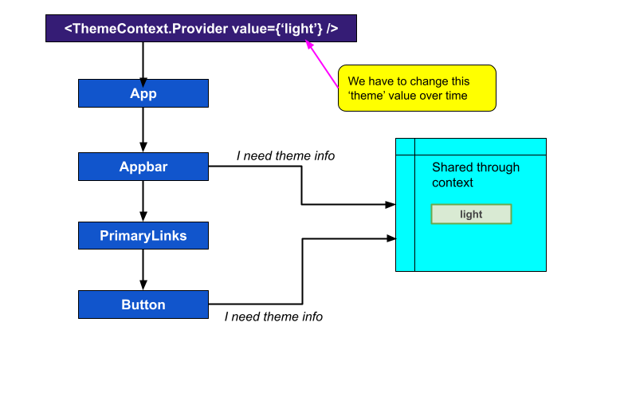
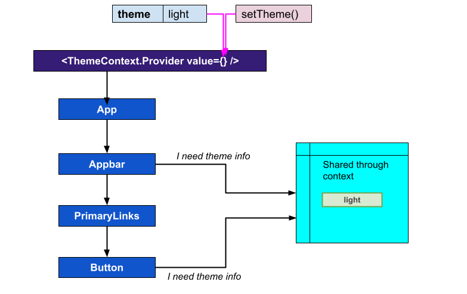

# Script
So far, we've created the context object and using the provider we've shared the same information to the child components.

So, because we've provided 'light' as the value in the Provider, our context object is going to store the string **'light'** and any component can reach out to the context object and get access to that value.

The downside to our current application is that the string **'light'** is static and fixed. It doesn't change over time, and that's really not very useful. We need to somehow modify that value.

And of course, any time we modify that value, we probably want to make sure that any component that relies upon the value, such as **Appbar**, gets automatically rendered so it can show that new content on the screen.

And yeah.

Does any of this sound kind of familiar?

Let me re-iterate this once again:

We have some data inside of our app, and it's going to change over time. Whenever it changes, we want to re-render our content on the screen. And so that's a sign to us that we probably want to use some **state**.

So here's the idea. Whatever we put as **value** in `ThemeProvider`, we have to change it over time.

Here I want to give it a variable name, say `theme`. So we want to have some kind of `theme` piece of state that is going to change over time. And somehow we've to define a function that can change the `theme` value. We can name that funtion as `setTheme()`. 

And in Provider, instead of passing just the simple string, like **'light'** or **'dark'**, we've to pass both the `theme` variable and `setTheme()` function. So we can pass it as an object, like this:

So now the rest of our application, can receive this object, that has the `theme` piece of state, and a function i.e. `setTheme()`, to change it over time.

So now any component, can reach out to our context, get access to the current `theme` and a function to change it very easily.

And in order to implement that, we will create a new Custom Provider component. So, lets get started.
