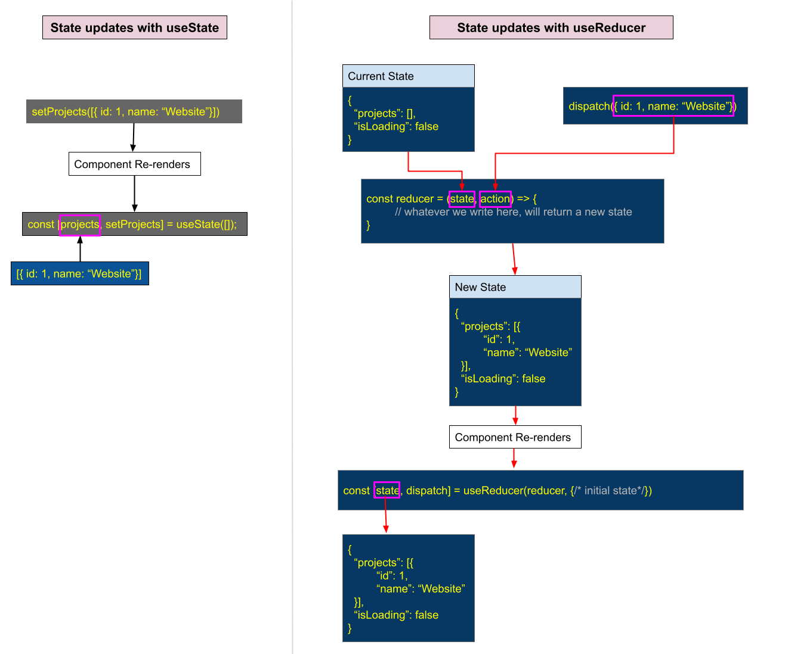

# Text
In this lesson, we will learn about the role of `reducer` function and how the state update actually happens, in the useReducer function. By the end of this lesson, you will have a clear understanding of what are the rules or do's and dont's you should keep in mind while using useReducer hook. So, let's dive in.

# Script
As I said before, the `useReducer` hook is similar to the `useState` hook, but instead of managing a single state value, **it manages a state object** and allows you **to dispatch actions to update the state**.

Now, the real challenge around the useReducer hook, is understanding how we update our states. Let me explain it by a diagram:


> Action: Open the diagram and start the explanation

So here on the left hand side we have to useState hook. Which updates the state in a preety much simple and straightforward way. We have a **set** function, which expects a new value to update the state. And once the state updates, our component gets re-rendered automatically.

> Action: Next explain the RHS of the diagram
But with useReducer, the situation is a bit complicated.

So everything starts off with us calling the `dispatch` function. We get the `dispatch` function from the array, where we call the `useReducer` hook. It's the second element in that array. That `dispatch` function helps us to update the state. So any time we need to update our state, means  anytime we need to get our component to re-render when we are using useReducer, we are going to call `dispatch`.

When we would call `dispatch`, something really kind of strange is going to happen, as React looks for the `reducer` function that we've defined at the top of the file.

> Open ProjectList.tsx in VSCode, ane explain next para.
So in VS Code, we have the **reducer** function and we've passed it as the first argument to useReducer.


Now, whenever you call, `dispatch`, React is going to find that function and run it. When that function is
 executed by React, the first argument which we refer to as `state` is going to be whatever the current state of our component is, that is being maintained by that **reducer**.

So for you and me, it's going to be an object.

> Back to diagram (RHS)

The second argument is called `action`. The value of that second argument is going to be whatever we passed into `dispatch`.

When you call dispatch, you can pass in no arguments or you can pass in exactly one. If you pass in more than one argument, all the extras get thrown away and completely ignored.

So the first argument is going to show up in the `reducer` function as that second argument, that usually we call `action`.

Now, here is the interesting part. The `reducer` function is going to run, and the key is, whatever we return from that function is going to be our brand new updated state.

So let's imagine, for example, that inside of our reducer function, we implement some code that returns an object that looks like this
```js
{
  “projects”: [{
	“id”: 1,
	“name”: “Website”
  }],
  “isLoading”: false
}
```
- So this object, which we are returning from our reducer function, is going to be our new state for our component. 
- So our component is going to re-render.
- And from the `state` variable of the `useReducer` in our component, we can access the new updated state object.

So in short, just to summarize the cycle one more time, 
- we call a `dispatch` any time we want to update our state.
- If we put in any arguments to `dispatch`, they're going to show up as this second argument to `reducer`.
- The first argument is always going to be our existing `state`.
- Whatever we return is going to be the brand new `state` for our component.

### Few key points to remember, whenever we will deal with a `reducer` function
Now, I want to go over a couple of rules around the `reducer` function, and that's really important for us to understand now.

1. **First, whatever we **return** from reducer function, is going to be our brand new state. **
      
2. **If we return nothing, then our new state is going to be undefined.** 
      Means, in that case, React is going to say, Oh, you returned nothing, you returned `undefined`. Well, then your new state is going to be `undefined`. So we need to always make sure in a `reducer` function that we return some reasonable value, which can be used by our components.
3. Our reducer function **is never ever going to use anything like `async await`** and it's never going to make any requests. It's not going to have any **promises**. It's also not going to have any reference to outside variables. In other words, we want our `reducer` function to only operate on these incoming arguments of `state` and `action`.

### Summary
So, to summarize:
in this lesson, we've learned the role of the `reducer` function and the process of state updates. We've also leaened, how `useReducer` manages state objects and dispatches actions for updates, providing a structured alternative to `useState`. Key points, such as returning meaningful values from the reducer function and avoiding asynchronous operations, are also highlighted.

So, that's it for this lesson, see you in the next one.

